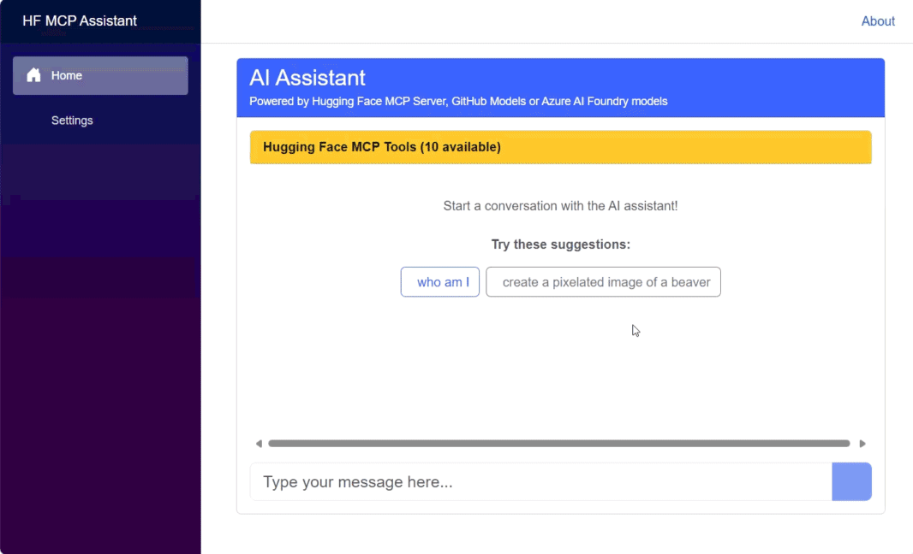

# Hugging Face MCP Server Samples: AI Image Generation with C#

## Table of Contents

- [Overview](#-overview)
- [Requirements](#-requirements)
  - [General Prerequisites](#general-prerequisites)
  - [Getting a GitHub Token](#getting-a-github-token)
  - [Getting a Hugging Face Access Token](#getting-a-hugging-face-access-token)
- [Sample Solutions](#️-sample-solutions)
  - [Console Apps](#1-console-apps-src-hfmcpgenimagesln)
  - [.NET Aspire Blazor WebApp](#2-net-aspire-blazor-webapp-src-hfmcpgenimagesln)
- [References & Resources](#-references--resources)

This folder contains samples demonstrating how to connect to and use the tools from the [Hugging Face MCP Server](https://huggingface.co/settings/mcp). The main scenario covered is generating images using the MCP Server, leveraging both cloud-hosted and local models.

---

## 🚀 Overview

You will find two main types of samples:

- **Console Apps**: Demonstrate how to connect to the Hugging Face MCP Server and generate images using C#.
- **.NET Aspire Blazor WebApp**: A modern web application for generating images using GitHub Models or Azure AI Foundry Models, with a user-friendly interface and extensible architecture.

This is the .NET Aspire Blazor App running:
    

---

## 🛠️ Requirements

### General Prerequisites

- [.NET 9 SDK](https://dotnet.microsoft.com/download/dotnet/9.0)
- Hugging Face MCP Server access
- (Optional) Ollama for local model inference
- (Optional) GitHub Token or Azure AI Foundry credentials

### Getting a GitHub Token

1. Go to [GitHub Personal Access Tokens](https://github.com/settings/personal-access-tokens/new)
2. Create a new token with Models API access
3. Copy the token and paste it in the Settings page

### Getting a Hugging Face Access Token

1. Go to [Hugging Face Access Tokens](https://huggingface.co/settings/tokens)
2. Create a new token
3. Copy the token and paste it in the Settings page

## �️ Sample Solutions

### 1. Console Apps ([src/HFMCP.GenImage.sln])

This solution contains two console applications:

- **MCP-01-HuggingFace**: Uses GitHub Models or Azure AI Foundry models via the Hugging Face MCP Server.
- **MCP-02-HuggingFace-Ollama**: Uses a local model with Ollama via the Hugging Face MCP Server.

#### How They Work

These apps:

- Connect to the Hugging Face MCP Server using the MCP SDK for .NET
- List available tools (including image generation)
- Generate images from text prompts (e.g., "create a pixelated image of a beaver")
- Support both cloud-hosted models (GitHub, Azure AI Foundry) and local models (Ollama)

##### Quick Start

**Setup:**

   ```bash
   git clone https://github.com/microsoft/mcp-dotnet-samples.git
   cd mcp-dotnet-samples/huggingface-genimages/src/MCP-01-HuggingFace/
   ```

**Configure Secrets:**

   ```bash
   # Example for User Secrets
   dotnet user-secrets set "HF_API_KEY" "<your_hf_token>"
   dotnet user-secrets set "GITHUB_TOKEN" "<your_github_token>"
   # For Azure AI Foundry, set endpoint, apikey, and deploymentName as needed
   ```

**Run the Sample:**

- Using GitHub or Azure AI Foundry Models:

   ```bash
   dotnet run --project ./src/MCP-01-HuggingFace
   ```

- Using a Local Model with Ollama:
  Start Ollama locally, then run:

  ```bash
  dotnet run --project ./src/MCP-02-HuggingFace-Ollama
  ```

**Example Output:**

1. Connects to the Hugging Face MCP Server
2. Lists available tools
3. Generates an image from a prompt

Sample prompt:
> create a pixelated image of a beaver

Sample output image:


**Code Snippets:**

Connecting to the Hugging Face MCP Server:

   ```csharp
   var hfHeaders = new Dictionary<string, string>
   {
   	{ "Authorization", $"Bearer {config[\"HF_API_KEY\"]}" }
   };
   var clientTransport = new SseClientTransport(
   	new()
   	{
   		Name = "HF Server",
   		Endpoint = new Uri("https://huggingface.co/mcp"),
   		AdditionalHeaders = hfHeaders
   	});
   await using var mcpClient = await McpClientFactory.CreateAsync(clientTransport);
   ```

Listing Available Tools:

   ```csharp
   var tools = await mcpClient.ListToolsAsync();
   foreach (var tool in tools)
   {
   	Console.WriteLine($"Connected to server with tools: {tool.Name}");
   }
   ```

Generating an Image:

   ```csharp
   IChatClient client = GetChatClient();
   var chatOptions = new ChatOptions
   {
   	Tools = [.. tools],
   	ModelId = deploymentName
   };
   var query = "Create an image of a pixelated beaver.";
   var result = await client.GetResponseAsync(query, chatOptions);
   Console.Write($"AI response: {result}");
   ```
---

### 2. .NET Aspire Blazor WebApp ([src/HFMCP.GenImage.sln])

This solution is a modern .NET Aspire application that brings AI-powered image generation to your browser. It is designed for extensibility, security, and a great developer experience.

#### Solution Structure

- **HFMCP.GenImage.AppHost**: Aspire orchestration project. Launches and manages the solution.
- **HFMCP.GenImage.ApiService**: API service that handles requests between the web UI and AI models.
- **HFMCP.GenImage.ServiceDefaults**: Shared configuration and service defaults for the solution.
- **HFMCP.GenImage.Web**: Blazor web application providing the AI chat interface and settings UI.

#### Setup

1. **Clone the repository**

   ```bash
   git clone <repository-url>
   cd huggingface-genimages/src/HFMCP.GenImage.AppHost
   ```

1. **Build and run the solution**

   ```bash
   dotnet build
   dotnet run
   ```

   The Aspire dashboard and web application will be available at the URLs shown in the console output (e.g., `https://localhost:17147`).

1. **Configure AI Services**

   - Open the web application and go to the Settings page.
   - Enter your Hugging Face Access Token.
   - Enter your GitHub Personal Access Token.
   - Select your preferred AI model (default: gpt-4-1-mini).
   - Save the configuration.

#### Usage

- Type your message and press Enter to chat with the AI
- Go to Settings to change model or token
- All configuration is stored securely

**Supported Models:**

- GPT-4.1-mini (recommended)
- Llama 3.2
- Any model available that supports function calling

You can switch models at any time from the Settings page.

---

## 🔗 References & Resources

- [Hugging Face MCP Server](https://huggingface.co/settings/mcp)
- [C# MCP SDK](https://github.com/modelcontextprotocol/csharp-sdk)
- [GitHub Models](https://github.com/marketplace?type=models)
- [Ollama](https://ollama.com/)
- [Blog post: Using C# to Call Hugging Face MCP Server and Generate AI Images](https://elbruno.com/2025/07/21/%f0%9f%a4%96-using-c-to-call-hugging-face-mcp-server-and-generate-ai-images/)
- [Generative-AI-for-beginners-dotnet: HFMCP.GenImage](https://github.com/microsoft/Generative-AI-for-beginners-dotnet/tree/main/05-AppCreatedWithGenAI/HFMCP.GenImage)
